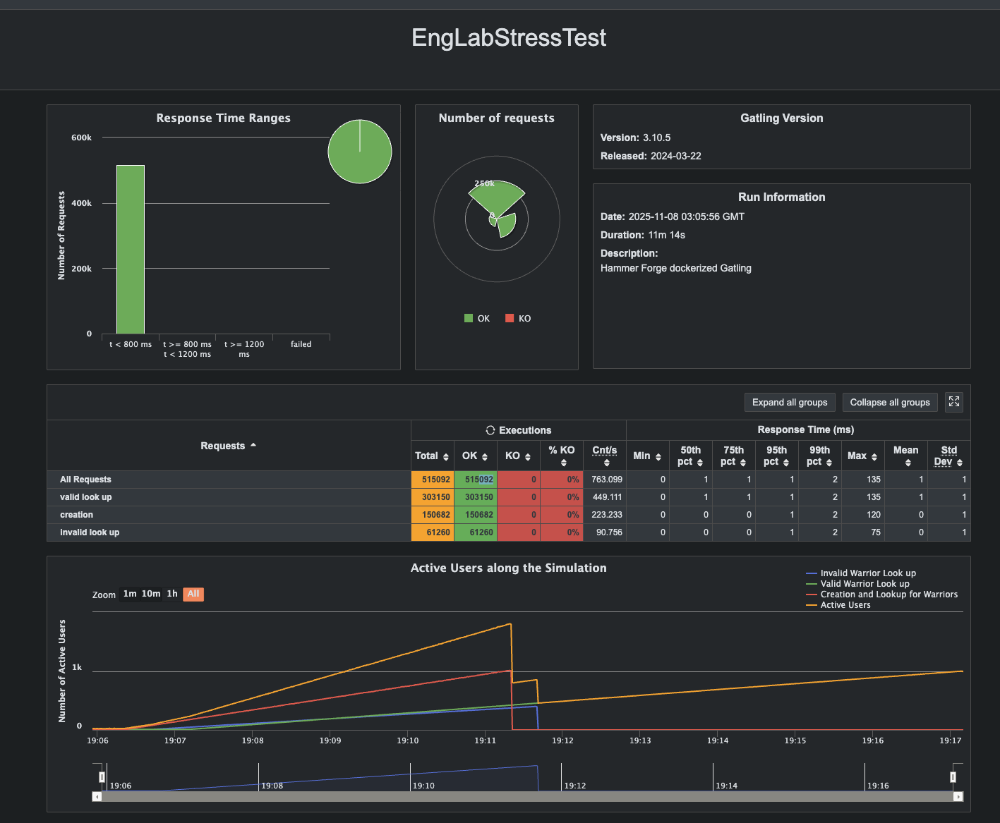

# API Hammer



### Prerequisite
```
Gradle version: 8
Java version: jdk 21
```

### Build
```bash
gradle clean build

# if needed, remove cache then rebuild
rm -rf ~/.gradle/caches
```

### Run
```bash
cp .env.example .env  # customize credentials if needed

# build + run database + 2 Spring Boot replicas behind nginx
docker compose up -d --build --scale app=2
```

### Test
```bash
# hit nginx which load-balances the app containers
curl http://localhost/health

# reach nginx' aggregated health endpoint
curl http://localhost/healthz

# inspect container health
docker compose ps

# run Gatling inside Docker with wide port range + tuned sysctls
./stress-test/run-gatling-container.sh
```
